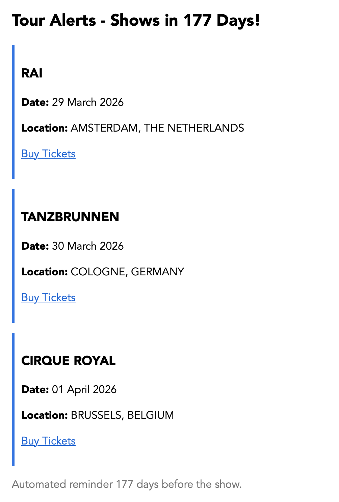

# Tour Date Scraper

[](https://github.com/lluzia/tour_date_scraper/actions/workflows/main.yml)

This project is a **Python Selenium-based scraper** that extracts **tour date information** from multiple regional URLs (stored securely as environment variables) and sends automated **email reminders** a set number of days before each show.

It is designed to:

* Scrape **JavaScript-rendered tour pages** using Selenium + ChromeDriver.
* Parse **date, venue, city, country, and ticket links** for upcoming shows.
* Send **HTML-formatted email notifications**.
* Run automatically via **GitHub Actions**, with detailed logs in `./logs/`.

---

## 🚀 Features

* **Headless Chrome** for scraping JS-heavy pages.
* Reads all tour URLs from **secure environment variables (secrets)**.
* Deduplicates shows across all tour regions.
* Logs events with Python’s built-in `logging` (INFO or DEBUG level).
* Sends rich HTML **email reminders**.
* Can run both:

  * **Locally** for manual testing.
  * **Automatically** on **GitHub Actions** (scheduled or manual trigger).

---

## 📦 Requirements

* Python 3.10+
* Google Chrome + ChromeDriver
* Dependencies listed in [`requirements.txt`](requirements.txt):

  ```txt
  selenium>=4.8.0
  ```

---

## 🔧 Local Setup

1. Clone the repository:

   ```bash
   git clone https://github.com/your-username/tour-date-scraper.git
   cd tour-date-scraper
   ```

2. Install dependencies:

   ```bash
   pip install -r requirements.txt
   ```

3. Set environment variables (either in `.env` or via terminal):

   ```bash
   export SMTP_SERVER=smtp.example.com
   export SMTP_PORT=587
   export SENDER_EMAIL=sender@example.com
   export SENDER_PASSWORD=app_password
   export RECIPIENT_EMAIL=recipient@example.com
   export LOG_LEVEL=INFO

   # Securely define your tour URLs
   export TOUR_URL_GENERAL=https://example.com/general-tour
   export TOUR_URL_UK=https://example.com/uk-tour
   export TOUR_URL_EUROPE=https://example.com/europe-tour
   export TOUR_URL_ASIA=https://example.com/asia-tour
   ```

4. Run the scraper manually:

   ```bash
   python tour_scraper.py
   ```

5. Logs will be saved to:

   ```
   ./logs/scraper_YYYYMMDD_HHMMSS.log
   ```

---

## 📧 Email Notifications

The script automatically sends styled HTML emails with details such as:

* **Show date**
* **Venue**
* **City & country**
* **Ticket link (if available)**
* **Tour region**

**Example preview:**


---

## 🤖 GitHub Actions Setup

This repository includes a workflow at
`.github/workflows/scrape-tour-dates.yml`.

It:

* Installs Chrome & Python.
* Runs the scraper every Monday, Wednesday, Friday and Sunday (1 AM UTC by default).
* Uploads the log files as build artifacts.

### Configure GitHub Secrets

Go to
**Repository → Settings → Secrets and variables → Actions → “New repository secret”**,
and add the following:

| Secret             | Example Value                      |
|--------------------|------------------------------------|
| `SMTP_SERVER`      | `smtp.example.com`                 |
| `SMTP_PORT`        | `587`                              |
| `SENDER_EMAIL`     | `sender@example.com`               |
| `SENDER_PASSWORD`  | `app_password`                     |
| `RECIPIENT_EMAIL`  | `recipient@example.com`            |
| `LOG_LEVEL`        | `INFO` *(or `DEBUG`)*              |
| `TOUR_URL_GENERAL` | `https://example.com/general-tour` |
| `TOUR_URL_UK`      | `https://example.com/uk-tour`      |
| `TOUR_URL_EUROPE`  | `https://example.com/europe-tour`  |
| `TOUR_URL_ASIA`    | `https://example.com/asia-tour`    |

> 🛡️ **All tour URLs and credentials are stored as secrets.**
> The script never exposes them in logs or output.

---

## 🗂 Logs

* Each run creates a timestamped log in `./logs/`.
* GitHub Actions uploads them as artifacts (`scraper-logs`).
* Logging level is controlled by `LOG_LEVEL` (`INFO` by default).

---

## 🧩 Example Console Output

```text
Starting tour date scraper...
[INFO] 4 tour URLs loaded securely from environment variables.
[INFO] Total unique shows found: 84
[INFO] Found 2 shows coming up in 60 days.
```

---

## 📨 Example Email Output

```html
<h2>Tour Alerts - Shows in 60 Days!</h2>
<div style='margin:20px 0; padding:10px; border-left:4px solid #0066cc;'>
  <h3>Sample Venue</h3>
  <p><strong>Date:</strong> 01 January 2026</p>
  <p><strong>Location:</strong> Sample City, Sample Country</p>
  <a href="https://tickets.example.com">Buy Tickets</a>
</div>
```

---

## ⚠️ Notes

* Replace example URLs with your real ones **only in GitHub Secrets** — never commit credentials.
* Works best on **Ubuntu runners** with Chrome/Chromedriver preinstalled.
* Always use **app passwords** for SMTP.
* `LOG_LEVEL` can be set to `DEBUG` for troubleshooting.
